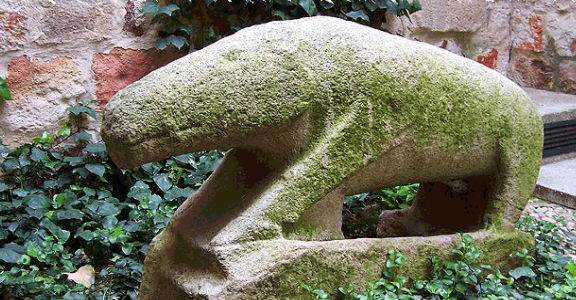

**Historia del Jamón en España**
Si tuviéramos que explicar la cultura española a través de un alimento, éste sería sin duda el jamón, presente hoy en día en la pintura, el cine la literatura y en nuestras casas, como un reflejo de lo que somos y de los que nuestros abuelos fueron. Un emblema que se extiende hoy en día más allá de nuestras fronteras bajo la marca España. 

Pero no es que queramos añadir épica al jamón, es que la tiene, su desarrollo es paralelo a la de los habitantes de la península ibérica y de esta forma, cada plato de buen jamón en nuestras casas es historia viva. Por eso hoy descubrimos en el blog los Orígenes del Jamón en la Península Ibérica.

**ORIGEN FENICIOS**

Sin cerdo no hay jamón, y es que fueron los fenicios, quienes introdujeron el cerdo en la península (1100 a.C) en lo que hoy conocemos como Cádiz a través de asentamientos como Gadir (Cádiz) o Malaka (Málaga). Este pueblo comerciante logró verdaderos prodigios en la industria de los salazones. En la actualidad, todavía existen las ruinas de algunas instalaciones destinadas al salado de carnes y pescado en las cercanías de Alicante y de Larache (Marruecos).

**ÉPOCA PRERROMANA**

Sea como fuere, cuando los romanos llegaron a la Península ya eran muchos los pueblos íberos y celtas que conocían y consumían el jamón. Para estos pueblos prerromanos, el cerdo era un objeto de culto, con el que comerciaban, siempre tratado con sal para su conservación.

```md

```



